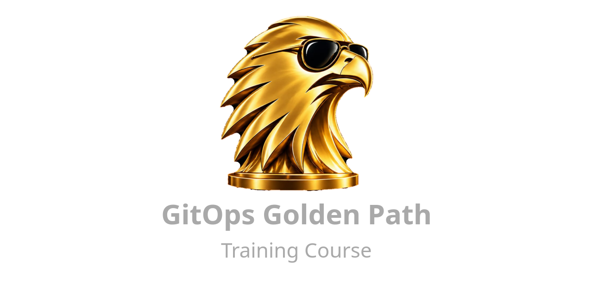

> [!NOTE]
> **Work in progress.** Acts I to IV are live and verified end to end. The remaining acts land here as each one's verification completes. [STATUS.md](STATUS.md) is the verification ledger.

# gitops-golden-path - the course

<!-- the preface is the author's own words; the course voice starts below it -->
<!-- vale off -->
> **From the author.** This course is the product of having designed and built a GitOps platform for a large, multi-tenant, multi-cluster, and multi-region SaaS system. The course shows you how to build a similar platform, starting locally then moving to the cloud, but with the learning through hindsight designed in from the start. I have tried to make it a more realistic example in terms of how to leverage the benefits of Git and GitOps in a production system, rather than show just the basics.
>
> In order to build this course, I have made heavy use of AI (Claude Code) to help me shape the course content and build out the helper scripts - and to do this much faster than if I had written myself from scratch. However, the ideas, requirements, layering, editing and direction of the course were designed and tested by me. I have added model attribution to reflect this as I believe it is important to show provenance honestly.
<!-- vale on -->

**Build the GitOps platform you would want to inherit: eight acts, one laptop, every claim measured.**

Most GitOps tutorials stop where the real work starts: one cluster, one environment, a Flux apply, done. This course starts there and keeps going the way a platform team has to. Three clusters on a promotion ladder. Secrets you can rotate and prove rotated. A robot that promotes at the entry rung and humans above it, with a declared soak between. An SLO that says no. A second tenant that cannot see the first. Then a cloud that absorbs each layer you built by hand, so you can read the diff and see what it does for you. Every stage ends at a **stop-and-measure** point whose checks are scripts, every act ends with a **rebuild from nothing**, and every number you record comes from an artifact, never a stopwatch.

What you leave with is the answer to the question every auditor and every new hire asks: **what is production running, who approved it, and how do you know?** Every act ends with that question answered from git and the cluster alone, no memory and no scrollback, and the config repo you build *is* the platform that answers it: its gates, drills, evidence scripts and operating skills are the ones a real fleet keeps, and [take it to production](appendices/take-it-to-production.md) says what each assumes about the course and what to change.

- **Who it is for.** Engineers who own a delivery platform, or are about to: you have run Kubernetes, you have met Flux or Argo, and you want the operating discipline rather than another hello-world.
- **What it costs.** A laptop that runs kind; a GitHub account, on a paid plan for branch protection on a private repo (the free plan works, with seven named degradations); and for the last two acts an Azure subscription, with the bill stated before the wall.
- **How long.** Eight acts and 36 stages. A stage is an evening to a day, and every act's rebuild drill means you can stop and pick up later without losing the fleet.

## How the course works

**Three repos, one per job.** This one is the *course*: the walkthrough, the appendices, and the reference copies of the scripts, skills and decision records you will seed your config repo with at stage 00. The **config repo** (`gitops-golden-path`) is the one you build: a standard root-level GitOps repo from its first commit, tagged at every stage and act boundary so that "your tree should match `stage-07`" and `git diff stage-06..stage-07 --stat` are real things to say. The **app repo** (`gitops-golden-path-app`) is the prop: a deliberately boring .NET API with one Azurite dependency, whose only job is to be deployed. Nothing course-shaped ever lands in the config repo; nothing the config repo needs lives only here.

**The course is also your backlog.** Stage 00 seeds every stage as a GitHub issue and every act as a milestone into the config repo you are about to build, the same numbers for every reader, so progress is closed issues, "where am I" is a milestone bar, and every PR you open cites the work item it advances, exactly as a real change does. You do not so much read this course as work through its backlog.

**Every act ends with a rebuild-from-nothing, and the definition of "nothing" is the act's most important sentence.** `act-N-drill` rebuilds the state at the end of act N from git and runs its checkpoint; act N+1's cover says "not in this state? run `act-N-drill`". Through Act VI "nothing" means every kind cluster: git and a handful of root keys survive. Act VII narrows it to the cluster, because the cloud resources it reconciles hold data and identity trust; Act VIII widens it to the region. It cannot manufacture history: DORA, the change record and the evidence dossier read git and the metric store. So it is a rebuild mechanism for someone who followed along, not a way to start at Act VI.

## Before you start

- **Read two short pages once; the stages link back to them rather than re-arguing them.**
  - [The GitOps Golden Rules](rules.md): what the platform is built to obey, each rule with its reason, how it is enforced and where it is taught. Day-zero repository configuration; the commit and PR conventions; naming, layout, YAML style and identifier alignment; the render rule and tool provisioning; and the operating rules the platform exists to make true, from the loop invariant to the secrets taxonomy. The [vocabulary](rules.md#vocabulary) is there too: *stamp*, *binding*, *class*, *rung*, *forge*, *release channel*, *wave*, *era*, *IOU*, *gate*.
  - [Using the course](using-the-course.md): what the *course* obeys. How a stage is shaped, what the course seeds into your config repo, why the tutorial names no accounts, the tag at every boundary, and the idioms of its paste blocks.
- **Two tools before anything: `git`, and the GitHub CLI `gh`, logged in (`gh auth login`).** Stage 00's first step uses both before any verification has run. Install nothing else ahead of time: every other tool is pinned to a version the course derives rather than lists, and stage 00 step 2 checks each one and prescribes its exact install line when it is missing or wrong.
- **A paid GitHub plan (Pro or above) on the account that owns the config repo.** Branch protection on a *private* repository needs one, and this course puts protection on `main` from the first commit rather than at the first production deploy ([rule 1.3](rules.md#13-protection-from-day-zero-nothing-reaches-main-except-a-merged-pr)). That is a deliberate trade: for the first few stages every change is a branch, a PR, a read diff and a merge, even when the diff is one line, and that friction buys muscle memory by stage 04 and a payoff at every stage after it, where CI, rendered diffs, code owners, the image robot and change freezes each arrive as one more thing attached to a PR you were already opening. It is also the only shape a reader under four-eyes controls can follow without forking the course. The same plan meters **GitHub Actions minutes** on a private repository (3,000 a month on Pro, 2,000 on Free); the config repo runs CI on every PR and merge from [stage 08](act-3/stage-08.md), a day at the busiest stages uses well under an hour, and the app repo is public, where runners are free.
  > **Staying on the free plan with a private repo.** The course survives it: the practice is yours, only the enforcement is the forge's. It degrades in exactly seven places, none silent for long. Five lines fail loudly with `Upgrade to GitHub Pro or make this repository public`: the ruleset at stage 00 (and its `ruleset show`), and `scripts/ruleset` at stages 08, 11 and 21; skip them. Stage 00's refused-push test then *succeeds*, which is the same lesson the slow way. Two features do nothing on a free private repo: auto-merge (stage 14's workflow falls back to waiting for the checks itself, then merging) and CODEOWNERS (stage 21 requests nobody; `path-gate` still reports). Every "watch the merge get refused" gate becomes "watch yourself choose not to merge". The seven lines you type per change are identical, the muscle memory is identical, and what you cannot fake is the one thing the ruleset exists for: a mistaken `git push` to `main` lands. A public config repo gets the enforcement back; [stage 21](act-5/stage-21.md) explains why that is the wrong answer for a real fleet.
- **The course leans Azure, but only at the end.** Acts I to VI run entirely on your laptop: kind clusters, and Azurite standing in for blob storage. Only Acts VII and VIII need a real Azure subscription, and the Act VII preamble warns again at that wall, with costs. If your cloud is elsewhere, the first six acts still teach everything they teach; the last two are a worked Azure example of ideas that translate.

## What you are given

Stage 00 copies the course's `seed/` into your config repo: the scripts, the operating skills, the decision records and the templates a real platform repo keeps. Two commands tell you what that is, and they stay true because they read the scripts' own headers:

- `./scripts/help` lists every script with what it does, grouped by family, then the operating skills; `--all` adds each one's usage and examples.
- `./scripts/<name> --help` prints one script's header: what it does, `Usage:`, `Arguments:`, `Options:`, `Environment:`, `Examples:` and `See also:`, in the layout `kubectl` and `flux` print.

[The scripts](appendices/scripts.md) is that menu as a page, generated from the same headers; [the operating skills](appendices/operating-skills.md) says where each skill fits and where it stops.

## Appendices

Reference pages that serve several stages, linked where relevant and ignorable otherwise.

- [The toolbox](appendices/toolbox.md): stage 00's companion. Every tool the course uses, what it does, how it installs and why.
- [The scripts](appendices/scripts.md): every seeded script with its usage, options and examples, read off the headers `--help` prints.
- [The operating skills](appendices/operating-skills.md): the Claude Code skills seeded beside the scripts, what each sequences and where the human's line is.
- [The commit convention](appendices/commit-convention.md): stage 02 onward. The domain vocabulary, the scope registry, and the nine rules that make it decidable.
- [The git policy](appendices/git-policy.md): stage 02 onward. Merge-commit-only, why the merge commit is the PR record, and the settings that enforce it.
- [GitOps patterns](appendices/patterns.md): ways of working several stages use and none names, from base and overlays and the empty diff to one change in flight per rung. A page that grows.
- [What the rules buy](appendices/what-the-rules-buy.md): the rules read feature first. Each thing the platform can do and the rules that build it, what git, GitHub and the tools give for free, and the order the rules pay off in.
- [Assume the clone leaks](appendices/repo-leak-posture.md): stages 06, 07 and 31's companion. Why repo secrecy is a delay rather than a control, and what must be true when a full clone walks out.
- [.NET workloads under a hardened baseline](appendices/dotnet-under-hardening.md): stage 08's companion. What actually breaks, what is folklore, and the AOT boundary.
- [The compliance evidence map](appendices/compliance-map.md): control, mechanism, evidence, query; and the ten-minute exercise.
- [Take it to production](appendices/take-it-to-production.md): what the config repo you built keeps, what each part assumes about the course's fleet, and what a real fleet adds.

## The eight acts

These tables are also your backlog: stage 00 seeds them into the config repo as a milestone per act and an issue per stage, and every PR you open cites the one it advances. Acts VII and VIII, and stages 23–25 and 28–29, are not yet written; their rows say what they will cover.

### Act I - The complete loop

*Act outcome: a change merged to main is running on a cluster, and you saw it succeed or fail without touching kubectl. Loop invariant: merge → reconcile → observable outcome → human informed.*

| Stage | Doc |
|---|---|
| 00 - Prerequisites & the app repo | [stage-00.md](act-1/stage-00.md) |
| 01 - Plain manifests (the pain) | [stage-01.md](act-1/stage-01.md) |
| 02 - Kustomize | [stage-02.md](act-1/stage-02.md) |
| 03 - Flux bootstrap | [stage-03.md](act-1/stage-03.md) |
| 04 - Closing the loop | [stage-04.md](act-1/stage-04.md) |
| Act I checkpoint | [act-checkpoint.md](act-1/act-checkpoint.md) |

### Act II - Production shape: the fleet exists

*Act outcome: a change promotes platform → dev → prod by PR across three live clusters. Loop invariant preserved, now per cluster.*

The dev/prod kind clusters are **stand-ins with a planned retirement**: Act VIII stands up AKS clusters as new fleet members and moves the stamps onto them by binding-move PR. The layout being exercised here is the migration path.

| Stage | Doc |
|---|---|
| 05 - Helm via Flux | [stage-05.md](act-2/stage-05.md) |
| 06 - Secrets | [stage-06.md](act-2/stage-06.md) |
| 07 - Environments & promotion | [stage-07.md](act-2/stage-07.md) |
| Act II checkpoint | [act-checkpoint.md](act-2/act-checkpoint.md) |

### Act III - You'd know when it breaks

*Act outcome: one broken stamp among many is found from a dashboard, not from a hunch; a release that converges green while failing every request is caught by the error budget and blocked from prod by the gate; and the four DORA numbers come from artifacts, not a spreadsheet.*

| Stage | Doc |
|---|---|
| 08 - Dependencies & health | [stage-08.md](act-3/stage-08.md) |
| 09 - Fleet observability | [stage-09.md](act-3/stage-09.md) |
| 10 - The four numbers (DORA, per cluster and per tenant) | [stage-10.md](act-3/stage-10.md) |
| Act III checkpoint | [act-checkpoint.md](act-3/act-checkpoint.md) |

### Act IV - Promotion, operated

*Act outcome: every commit is gated before it is pushed; every PR shows what clusters will receive; the platform and the app image both ride the ladder, by robot at the entry rung, by human above it; the build tells the fleet rather than the fleet polling; and the Kubernetes version ladder has climbed one minor.*

| Stage | Doc |
|---|---|
| 11 - Shift left (git hooks, and the style gate) | [stage-11.md](act-4/stage-11.md) |
| 12 - Rendered diff (blast radius on every PR) | [stage-12.md](act-4/stage-12.md) |
| 13 - Platform promotion (change the ingress version) | [stage-13.md](act-4/stage-13.md) |
| 14 - Image automation (the robot on the dev rung) | [stage-14.md](act-4/stage-14.md) |
| 15 - The event that arrives (push, not poll) | [stage-15.md](act-4/stage-15.md) |
| 16 - The version ladder climbs | [stage-16.md](act-4/stage-16.md) |
| Act IV checkpoint | [act-checkpoint.md](act-4/act-checkpoint.md) |

### Act V - Secrets & access: what good looks like, locally

*Act outcome: what stage 06 promised, delivered on a fleet of three class keys: rotation with revocation, per-principal custody, values reaching pods, roll-forward instead of revert, and owners on every path the ladder cannot gate. Practised here because Act VII moves custody to a vault, and you should know what the vault is absorbing.*

| Stage | Doc |
|---|---|
| 17 - Key rotation | [stage-17.md](act-5/stage-17.md) |
| 18 - Team keys | [stage-18.md](act-5/stage-18.md) |
| 19 - Reloader | [stage-19.md](act-5/stage-19.md) |
| 20 - Roll forward: the artifact that decays | [stage-20.md](act-5/stage-20.md) |
| 21 - Path protection (the ladder gets teeth) | [stage-21.md](act-5/stage-21.md) |
| Act V checkpoint | [act-checkpoint.md](act-5/act-checkpoint.md) |

### Act VI - Tenancy

*Act outcome: a second tenant exists and is isolated on every axis: config, identity, data, SLO, blast radius, calendar; app releases climb their own ladder: release channels, advanced in waves, orthogonal to cluster class; every PR gets a preview environment stamped from the same tenancy machinery; and the structure is exactly what Acts VII–VIII hang federated identities and credential scopes off.*

| Stage | Doc |
|---|---|
| 22 - Multi-tenancy: the second axis | [stage-22.md](act-6/stage-22.md) |
| 23 - Tenant access | *not yet written* - per-tenant RBAC and impersonation, lockdown flags, PSA `restricted`, a tenant-owned source flowing to the cluster |
| 24 - Tenant data | *not yet written* - the Azurite isolation ladder - shared account and per-tenant containers (naming is not isolation) → an account per tenant with its own key in a per-tenant secret |
| 25 - Ephemeral PR environments | *not yet written* - the developer request that never goes away, and the direct payoff of tenancy: a preview environment per PR as an ephemeral tenant (a stamp per PR, created on open, pruned on close, linked from a PR comment); stage 07's env-zero cluster is the naive form this stage retires |
| 26 - The change record (release notes with no releases) | [stage-26.md](act-6/stage-26.md) |
| 27 - The change freeze (a calendar, not a switch) | [stage-27.md](act-6/stage-27.md) |
| 28 - Release channels: app promotion is its own axis | *not yet written* - the release channel as a label on the binding, orthogonal to class (stage 22's house tenant is the internal channel on a prod-class cluster, made mechanical); the engineering → internal → pilot → early access → general availability gradient - names sharing no word with a class, label values kebab-case (`early-access`, `ga`), and an empty channel legal: its pointer follows its faster neighbour, ascent evidence is owed only where members exist, and the gate names whose soak window it judged; the retrospective on why version-named channels (dev/latest/stable) collapse; the three rules of [rule 5.13](rules.md#513-release-channels-ascent-is-judged-where-members-exist), shipped as `scripts/channel-gate` plus a required check: exactly one `release-channel` label per app binding, ascent only forward and only on a clean soak window from the nearest populated faster channel, a fast-channel binding on a prod-class cluster as a declared exception with expiry |
| 29 - Release waves: gradual rollout inside a release channel | *not yet written* - general availability partitioned by a `wave` label beside `release-channel`; a wave PR as the batched pin sweep with per-wave soak; a customer freeze holds their wave; stage 10's convergence measures first wave to last while DORA counts one change |
| Act VI checkpoint | [act-checkpoint.md](act-6/act-checkpoint.md) |

### Act VII - The cloud arrives before the cluster

*Act outcome: policy, identity and cloud resources are real and reconciled from git while the cluster is still local. The cluster is the last thing to move. One free stage, then the subscription wall.*

**The subscription wall, and the bill.** Stages 31–32 still run on kind: the subscription pays for identities, a storage account and a Key Vault. Pennies. The clusters that cost real money arrive in Act VIII, and the course treats them as **throwaway**: created for a working session, deleted at its end, rebuilt from git the next time. The same rebuild discipline every act has drilled, now with a bill attached, and the create/delete steps spelled out beside every use. The AKS shape is deliberately the cheapest that works; this is **not** a lesson in Azure infrastructure practice: basic AKS, for illustration only.

| Stage | Covers (not yet written) |
|---|---|
| 30 - Policy & supply chain | keyless cosign signing from the app repo's CI (GitHub OIDC - the first federation you see), syft SBOMs as signed attestations, Kyverno `verifyImages`, Flux `OCIRepository.spec.verify`, the stage-08 baseline re-enforced at admission (validate, never mutate), `PolicyException` with mandatory expiry, the CVE drill; the substitution boundary named plainly - `postBuild` runs *after* `verify`, so applied bytes are not signed bytes, and stage 09's allowlist ("named cluster facts, nothing else") is what keeps that gap small enough to sign; stage 09's reason vocabulary gains `VerificationError` and the admission denial |
| 31 - Workload identity on kind | the federation handshake hand-assembled: pinned SA signing keys, OIDC discovery + JWKS on a public blob, the apiserver issuer pointed at it, real Entra credentials federated against it; ESO swaps to Key Vault on the same manifests; the app swaps Azurite's connection string for token auth; the github-status-token becomes an ExternalSecret |
| 32 - Azure Service Operator | real Azure resources reconciled from the local cluster; the credential-scoping ladder (global → namespace → per-resource) mapped onto Act VI's tenants |
| Act VII checkpoint | "scratch" narrows to the cluster: tear it down, bring it back, watch ASO re-adopt what was never gone |

### Act VIII - Absorption

*Act outcome: managed services absorb the hand-built layers, one layer per stage, and the diff is small and readable.*

Act VIII looks like the final boss. The whole course exists so that it isn't: each stage is a small, readable diff replacing a layer you already understand.

| Stage | Covers (not yet written) |
|---|---|
| 33 - The cluster arrives | AKS via Bicep, Actions with OIDC; AKS joins the fleet by binding-move PR and the kind dev/prod clusters retire - Act II's promise, paid |
| 34 - The platform absorbed | the managed Flux extension replaces stage 03's bootstrap; ACR and managed image integrity replace stage 30's Kyverno |
| 35 - Identity absorbed | the managed OIDC issuer replaces stage 31's scaffolding; Key Vault custody replaces age (where stages 17–18 decay); the stage-32 ASO workloads migrate unchanged |
| Act VIII checkpoint | rebuild-region: the region comes back **in a different region**, the first presumed dark. Region is a Bicep parameter, identity re-federates against the new cluster's issuer, and the storage account is the honest RPO conversation (geo-redundancy, or documented loss). The first drill that costs money, behind `--yes` with a printed estimate; federated credentials must live in the same Bicep as the cluster or a rebuild orphans every identity; RTO and RPO come out as measured numbers from artifacts, not assertions |

## Flux, not Argo CD

One reconciler, chosen once ([decision 0001](seed/decisions/0001-flux-not-argo-cd.md)). Flux, because everything it does is a CR in git and nothing else: no UI to become the operating surface, no RBAC model of its own, and an event model the whole evidence chain (commit statuses, alerts, the change record) is built on. The original tie-breaker was Azure's managed GitOps offering being Flux-only, so a hand-built platform is absorbed by the `microsoft.flux` extension in Act VIII with a small, readable diff. That half of the argument is now history: since 2026 Azure also offers Argo CD as a managed extension (`Microsoft.ArgoCD`, in preview, with workload identity and Entra SSO). Argo CD is a legitimate choice for a team today, and this course would still teach the same platform. What transfers unchanged: the repo layout, the PR discipline, the rungs, the identifiers, the gates and the evidence - none of it is reconciler-specific. What changes: the reconciler's own CRs (stamps become an `Application`), the notification loop, and the absorption stage. Argo CD is described here once and never runs.

## Side quests

Everything the platform needs to be *operated* is a trunk stage, because "optional" reads as "skippable" and none of it is: gates, rendered review, robots, secrets done properly, tenancy, the change record, the freeze. A **side quest** is the genuinely optional material: a drill or a deep dive that throws a scenario at machinery the trunk already built. Each one assumes the end state of the act it unlocks after, and can be taken, skipped, or saved for later without renumbering anything. Do one when you want the platform stress-tested rather than extended; the payoff is an evidence artifact, and usually a runbook you now trust because you have run it.

Seven are queued; none are written yet. A quest's work item is raised **on demand**, never seeded: `tools/start-quest <quest> <owner>/<repo>`, run from the course checkout when you begin one, creates the issue with whatever number is next in your repo, which is why the text never cites quest numbers. The drills arrive shaped as the incident they simulate: the breach rotation and break-glass drills open as **sev0 bugs** against the platform, and every PR a drill produces cites its incident until you close it by hand with the evidence in.

| Quest | Unlocks after | Covers (not yet written) |
|---|---|---|
| Migrate a base change | Act IV | Run with the `promote` skill. The expand/contract lifecycle for config, end to end: a base change enters as an overlay patch on one rung, promotes rung by rung with soak, folds into `base/` as an empty rendered diff, becomes a null-op, then loses its references - stage 12's rendered diff showing the shrinking remainder at every step ([rule 5.14](rules.md#514-variants-flags-and-migrations-three-lifecycles-three-homes)). Ships the migration age nag: an overlay past its age budget fails CI instead of stalling silently |
| When the X goes red | Act IV | The platform grows reflexes, all keyed off the one status that can only mean the world disagrees with git (CI reds never land): a red on `main` opens an incident issue (MTTR from artifacts), drafts - never merges - the revert PR, and pauses the robot; the green closes the incident. Plus the Environments mirror: each stamp's reconciliation recorded as a GitHub Deployment, so the repo's own Environments view shows what runs where - a mirror, deliberately never a gate |
| The breach rotation drill | Act V | Run with the `rotate-secret` and `run-drill` skills. A laptop holding a full clone and its age key is presumed compromised: everything it could hold is rotated and revoked at once (recipient removed, class keys re-wrapped, deploy key re-minted, robot token rolled forward), and the incident record is a PR citing a breach work item. Era-aware: re-run it after Act VIII and watch the runbook shrink as the vault and federation absorb it |
| The pre-approved PR | Act V | The review pyramid: every reviewable area posts a named verdict on the PR before a human looks. A change taxonomy read from the rendered diff, known-shape validation per domain commit type (a `promote` is exactly one pin move - proven, not trusted), resilience linting on the render, a computed risk rating that routes reviewers and sets the approval quorum, and an AI review layer that runs only when every deterministic gate is green and cites rule numbers and control IDs rather than opinions. The human reads a stack of verdicts and makes one small decision |
| The break-glass drill | Act VI | Run with the `break-glass` skill. The PR machinery itself is the outage: the forge is down, or a required check is stuck red while a production fix must land. Bypass loudly, land the fix, restore the controls to exactly their prior state, and prove the restore with `check-repo`. `freeze-gate`'s `Freeze-override:` trailer is the in-band sibling |
| The audit drill | Act VI | An auditor's questions answered entirely from git, statuses and the backlog, by the `audit-evidence` skill: every prod change in a window, who approved each, what evidence gated it, and what ran on a given date |
| OCI-published config artifacts | Act VII | From git-path reconciliation to CI-built, signed, per-cluster config artifacts: the destination the fleet's verification spine points at |

## Contributing

Errata are the most valuable thing you can send: you walked a stage, a step failed, and the issue template captures the paste. Small fixes ride PRs through the same gates the author faces; content and design changes start as issues, never PRs. The lane, the gates and the licensing of contributions: [CONTRIBUTING.md](CONTRIBUTING.md).

## Provenance

The course text and code were generated by AI (Claude Code) from the author's design, and read and tested by the author. Each commit's `Co-Authored-By` trailer names the model that wrote it.

## License

Two licenses, split by what a file is ([LICENSE](LICENSE) is the map):

- **Course text** (every `.md` in this repository - the walkthrough, rules, appendices, decision records): [CC BY-SA 4.0](LICENSE-docs). Use it, teach from it, translate it; credit **blairforce1**, and share adaptations under the same license.
- **Code** (`scripts/`, `tools/`, `skills/`, `.github/`, `env.sh`, and every command in a paste block): [MIT](LICENSE-code). Seed it, vendor it, keep it.
